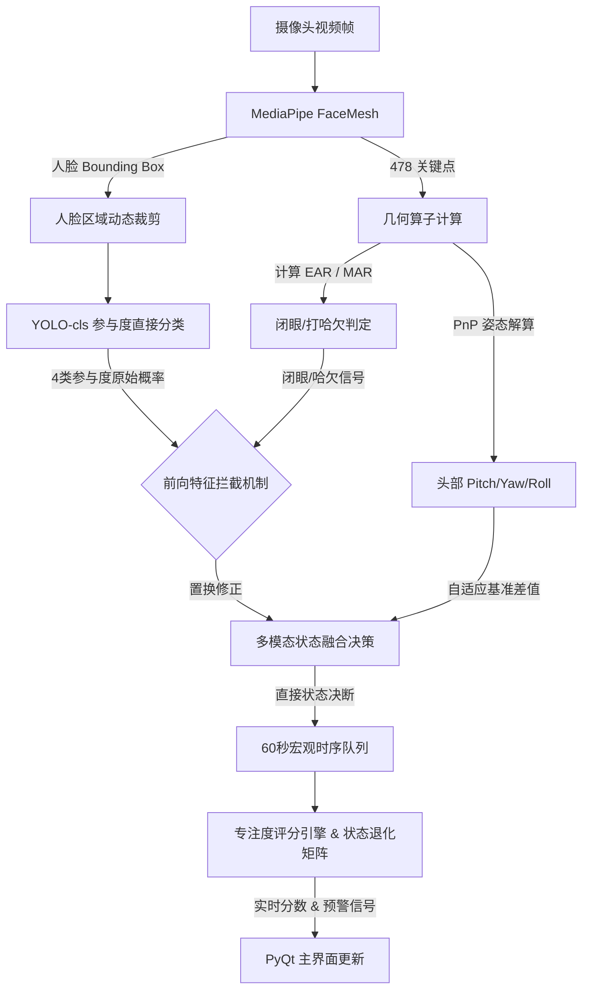
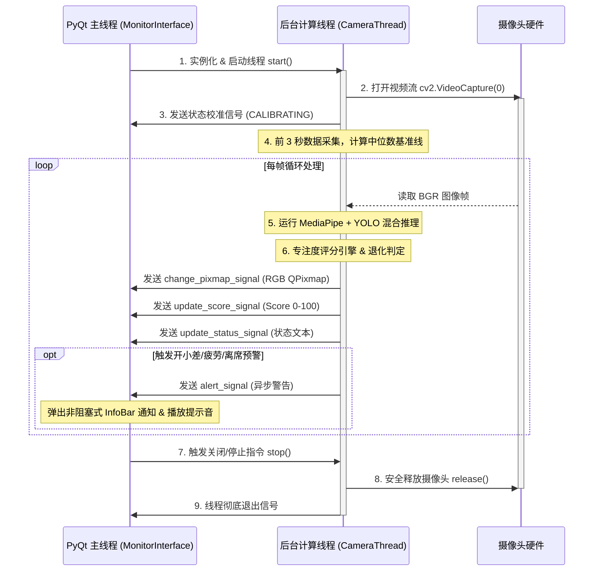

# 智能课堂学生自主分析系统 (Online Class Student Self-Analysis System)

🚀 **基于 PyQt5 + qfluentwidgets + YOLO26 + MediaPipe FaceMesh 的跨平台桌面级学生课堂专注度与注意力实时监控及统计分析系统**。

本项目从学术前沿教学与人机交互逻辑出发，将几何表情特征算子与多模态时序深度融合。通过轻量级的摄像头画面采集，在保障用户隐私的前提下，实现学生课堂状态的实时高精度感知、注意力评分动态追踪、开小差与疲劳预警，并生成完整的学习会话统计报表。

---

## 🌟 核心技术亮点与架构设计

### 1. 双通道多模态特征融合检测
系统摒弃了传统的单模型检测方案，采用 **MediaPipe 几何点位计算** 与 **YOLO 卷积特征分类** 双通道协同工作的架构：
*   **MediaPipe 通道**：实时提取面部 478 个三维面部网格关键点（Face Mesh），获取高精度的眼睛睁合度（EAR）与张嘴度（MAR）；同时，通过最具代表性的 6 个三维空间锚点（鼻尖、下巴、双眼角、双嘴角）解算 3D 头部姿态角。
*   **YOLO 通道**：利用 MediaPipe 动态计算出的人脸边界框（Bounding Box）进行 **20% 边缘外扩裁剪**，将裁剪后的脸部 ROI（感兴趣区域）送入轻量级面部表情分类模型（YOLO-cls），大大降低了宏观背景噪声对表情分类器的干扰，提升了推理帧率。

### 2. 精细化三维头部姿态估计 (PnP Solver)
利用 OpenCV 的 `solvePnP` 迭代算法，将 2D 像素坐标与 3D 面部通用几何模型进行映射。
*   **欧拉角解算**：实时获取头部 Pitch（俯仰角）、Yaw（偏航角）和 Roll（翻滚角）。
*   **物理直觉规范化**：针对欧拉角计算中常见的万向节死锁与角度跳变问题，算法强制限制旋转区间在人类生理极限（$-90^\circ$ 至 $+90^\circ$）内，并将低头动作统一映射为负 Pitch 轴度数，为低头检测提供高可靠性数据输入。

### 3. 自适应基准校准系统 (Adaptive Median Calibration)
由于摄像头摆放位置、学生坐姿和桌椅高度因人而异，硬编码的角度阈值往往导致极高的误报率。
*   系统启动后进入 **3秒自适应校准期**，在校准期内累计学生的 Pitch 和 Yaw 角度值。
*   校准结束时，利用 **中位数（Median）物理滤波** 锁定每个学生专属的“正视屏幕基准线”，彻底消除单帧极值或眨眼离群值对基准线的影响。后续监控均基于与该基准线的绝对偏差（$\Delta\text{Pitch}, \Delta\text{Yaw}$）进行判定。

### 4. 前向特征拦截与时序平滑评分引擎
*   **前向特征拦截 (Pre-inference Masking)**：当 MediaPipe 几何算子检测到学生处于打哈欠（$\text{MAR} > 0.65$）或长闭眼（连续闭眼 $> 2$秒）时，系统启动拦截机制，强行屏蔽 YOLO 表情分类器可能产生的误判（例如眨眼/打哈欠容易被误分类为 Happy 或 Surprise），剥夺其概率并平滑迁移至 Neutral（自然）状态。
*   **双重时间滑动窗平滑**：
    *   **微观平滑（3秒）**：对表情概率矢量进行均值平滑，消除逐帧抖动。
    *   **宏观追踪（60秒）**：使用 60 秒时序队列缓存决断状态，保障评分指标的连续与稳定。
*   **多维疲劳综合指数 (Fatigue Index)**：根据现代教学文献模型，综合 PERCLOS（眼睑闭合时间比例）、眨眼频率、打哈欠频率及点头频率动态加权计算疲劳指数，当疲劳指标超限时，自动切入疲劳状态。

### 5. 智能行为退化与惯性冗余逻辑
针对学生特有的课堂行为（如“低头记笔记”与“低头玩手机/走神”的区分，以及“短暂遮挡”与“离席”的区分），系统设计了复杂的退化矩阵：
*   **低头判定矩阵**：连续低头（$\Delta\text{Pitch} < -15.0^\circ$）超过 15 秒时：
    *   若低头前学生专注度分数 $\ge 60$ 分，系统判定其处于 **TAKING NOTES (记笔记)** 专注状态，不予扣分；
    *   若低头前分数 $< 60$ 分，系统判定为 **DISTRACTED (分心)** 状态，并以超时时间的二次方曲线（$\Delta t^2 \times 0.2$）进行非线性扣分惩罚，并触发异步警告。
*   **面部丢失（离席/遮挡）退化**：面部信息丢失时：
    *   **惯性缓冲保护**：若丢失前学生处于“记笔记”状态，系统提供 **5秒的惯性冗余**。在 5 秒内依然记为记笔记状态，不扣分，数据平滑填充；
    *   **短时离席曲线**：若非记笔记状态下丢失，系统在 120 秒内套用 **三次方收敛衰减曲线**（$\text{Decay} = (\frac{t}{120})^3$），呈现“先缓后急”的扣分趋势，契合人体行为心理；
    *   **长时离席判定**：超过 120 秒，状态彻底退化为 **ABSENT**，分数归零，并发出高频离席警报。

---

## 🛠 系统工作流与架构图

### 1. 多模态数据融合与状态评估流


### 2. 多线程安全交互机制


---

## 📂 项目目录结构说明

```plaintext
self-analysis-system/
├── main.py                 # 应用唯一入口，配置高DPI缩放、主窗体框架与侧边导航
├── requirements.txt        # 核心第三方依赖库列表
├── AGENTS.md               # 面向 AI 协作代理的设计规范与代码风格约束文件
├── README.md               # 本项目系统设计、数学机制与部署说明文档
├── weights/
│   └── best.pt             # YOLO 面部表情分类模型权重文件 (本地物理存储，不提交 Git)
└── app/
    ├── __init__.py         # 模块包初始化
    ├── camera_thread.py    # QThread 后台计算线程，主导摄像头 IO 与双通道 ML 推理循环
    ├── yolo_inference.py   # 封装 YOLO-cls 推理，集成多设备自动分配 (CPU/CUDA/MPS) 
    ├── mediapipe_inference.py # 封装 FaceMesh 计算，包含 PnP 姿态估计与人脸 ROI 裁剪框导出
    ├── attention_rules.py  # 注意力规则与决策评分引擎 (含前向拦截、退化矩阵与非线性扣分)
    └── view/
        ├── __init__.py     # 视图模块初始化
        ├── monitor_interface.py # 实时监控界面，基于 Fluent 组件，集成非阻塞异步 InfoBar
        └── report_interface.py  # 学习统计报表界面，预留 Matplotlib/PyQtGraph 可视化图表接口
```

---

## 🚀 快速开始

### 1. 环境准备 (Mac M1/M2/Intel & Windows)
推荐使用虚拟环境进行管理，以下以 Conda 为例：

```bash
# 1. 创建并激活 Python 3.10 虚拟环境
conda create -n sas-demo python=3.10 -y
conda activate sas-demo

# 2. 安装基础依赖与 GUI 库
pip install PyQt5 qfluentwidgets opencv-python numpy

# 3. 安装深度学习与推理依赖
pip install torch torchvision ultralytics

# 4. 安装 MediaPipe 几何检测器
pip install mediapipe
```

> **Mac M1/M2 芯片用户提示**：
> 系统中已内置了 MPS 设备自动检测。如果需要显式利用 Apple Silicon 硬件加速，请直接安装支持 MPS 的 PyTorch 编译版本。
> 本项目的 `yolo_inference.py` 中已包含 Windows 与 Posix 跨平台路径的反序列化补丁，完美支持 macOS 平台直接加载在 Windows 下训练的 YOLO 模型。

### 2. 权重部署
请将表情分类权重文件（例如从 RAF-DB 训练导出的分类权重 `best.pt`）放置于项目根目录的 `weights/` 下：
```bash
mkdir -p weights
# 将您的权重放入 weights 目录下，命名为 best.pt
```
*注：由于 `.pt` 文件体积较大，项目中的 `.gitignore` 已默认忽略 `weights/*.pt`，请避免将大型二进制模型推送到远程仓库。*

### 3. 运行系统
```bash
python main.py
```
*启动前请确保系统已赋予终端/IDE 摄像头访问权限。若在无摄像头的环境下进行调试，可进入 `app/camera_thread.py` 将 `cv2.VideoCapture(0)` 修改为视频文件路径。*

---

## 📊 状态判定机制与数学公式

### 1. 参与度认知状态直接分类
在系统升级后，YOLO 推理模型直接输出 4 类参与度标签（即 `Understand`、`Doubt`、`Disgusted`、`Neutral`），因此不需要旧架构中的情感概率融合计算，同时也舍弃了 3 秒表情平滑滑动窗口（micro_buffer）。

系统直接对当前帧输出的 4 个类别概率分布进行极值选择：

$$\text{State}_{\text{instant}} = \arg\max_{c} (p_c), \quad c \in \{\text{Understand}, \text{Doubt}, \text{Disgusted}, \text{Neutral}\}$$

最终，取当前帧概率最大的维度类别作为当前的瞬时参与度状态，并直接送入 60 秒宏观追踪滑动窗口（macro_buffer）中。

### 2. 疲劳度（Fatigue Index）计算
根据教育生理学模型，综合 8 秒滑动窗口内的生物特征：

$$\text{Fatigue} = 0.1 \cdot \text{PERCLOS} + 0.4 \cdot \text{BlinkFreq} + 0.3 \cdot \text{YawnFreq} + 0.2 \cdot \text{NodFreq}$$

当综合评分超过 $0.38$ 阈值时，认知状态将被强行覆写为 `Fatigued`。

### 3. 基础专注度得分 (Macro Score)
在 60 秒宏观统计时间窗内，各类状态占比对应的基准得分公式为：

$$\text{Score}_{\text{macro}} = \frac{1.0 \cdot N_{\text{Understand}} + 0.9 \cdot N_{\text{Neutral}} + 0.7 \cdot N_{\text{Doubt}} + 0.1 \cdot N_{\text{Disgusted}} - 0.5 \cdot N_{\text{Fatigued}}}{N_{\text{total\_frames}}} \times 100$$

### 4. 离席三次方衰减公式
当面部完全丢失（AWAY 状态），且非记笔记惯性期时，得分按时间 $t$ 采用三次方曲线进行非线性平滑衰减：

$$\text{Score}(t) = \text{Score}_{\text{before\_absent}} \cdot \left[1 - \left(\frac{t}{120}\right)^3\right], \quad (0 \le t \le 120)$$

---

## 📝 开发者规范 (Developer Guidelines)

为保障系统的稳定性与界面流畅度，在修改或扩展本项目时，请严格遵守以下开发规范：
1.  **UI 线程安全性（Critical Constraint）**：
    *   **严禁**在主线程（UI 线程）中进行耗时的 CV 图像处理或 YOLO 推理操作，否则会导致界面卡死。
    *   **严禁**从后台线程直接修改、读写 PyQt UI 控件。所有的跨线程通信、图像传递、弹窗预警，必须通过 `pyqtSignal` 在主线程对应的槽函数中安全执行。
2.  **图像颜色空间转换**：
    *   OpenCV 在读取和处理图像时使用 **BGR** 颜色空间，而 PyQt 显示图像（QImage, QPixmap）前，必须通过 `cv2.cvtColor(frame, cv2.COLOR_BGR2RGB)` 转换为 **RGB** 空间，否则会导致画面偏色。
3.  **无阻塞式交互**：
    *   避免在实时摄像头线程运行期间使用 `QMessageBox` 等阻塞式弹窗。项目已完美集成 `qfluentwidgets` 的 `InfoBar` 异步浮动警报机制，可实现平滑的气泡通知。
4.  **高 DPI 屏适配**：
    *   系统在 `main.py` 入口处配置了 `Qt.AA_EnableHighDpiScaling` 及 `Qt.HighDpiScaleFactorRoundingPolicy.PassThrough`，支持 4K 等高分屏的高清缩放。设计新 UI 时应优先采用弹性布局（Layout）而非硬编码绝对像素。

---

## 🗺 未来规划与待办 (Roadmap)

- [ ] **可视化报表深度编写**：在 `report_interface.py` 中引入 `pyqtgraph` 或 `matplotlib` 画布，实现 60 秒专注度曲线时序流图、疲劳分布饼图和专注热力图的实时渲染与历史导入。
- [ ] **高精度低头识别细化**：利用三维姿态角中的 Pitch 变动结合人脸面部网格纵向收缩比，构建更鲁棒的低头动作辨识分类器。
- [ ] **情绪理解时序特征化**：将基于单帧的浅层特征分类器升级为时序行为识别，分析学生在 5~10 秒内的情绪转变轨迹，迈向长时序细粒度情感计算。
- [ ] **更小模型的量化与微调**：对自建 RAF-DB 数据集训练出的表情模型进行 TensorRT / ONNX / CoreML 量化压缩，使轻量级 CPU 设备也能流畅保持 30FPS+ 的满帧运行体验。
